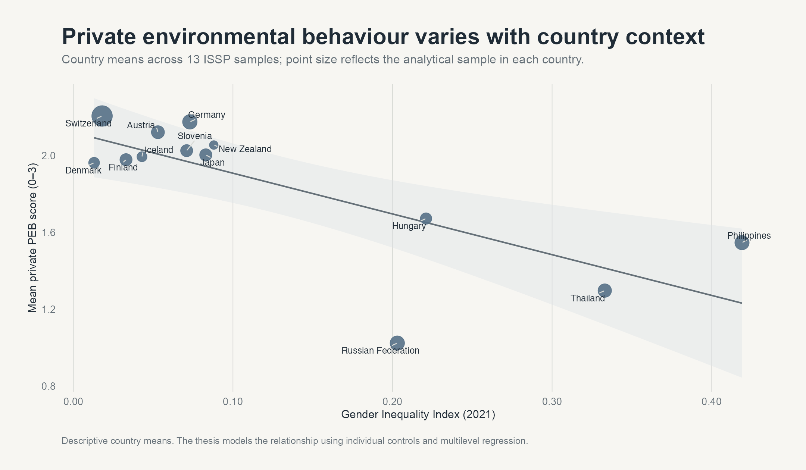
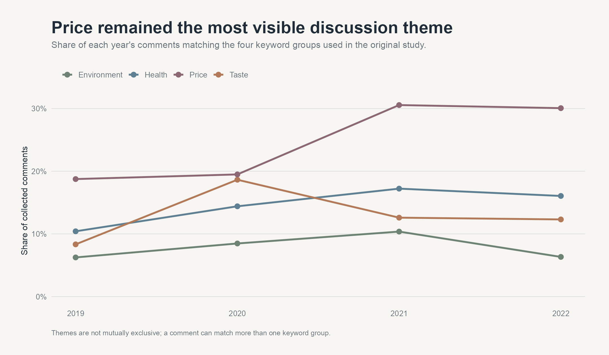

# Shengjia Luo · Portfolio & Research

**Bridging People, Data, and Real-World Decisions.**

Social science background × entrepreneurship. With an interest in what people want, why markets move, and where businesses can improve.

[Personal website](https://1111jia.github.io/SLuo_Profile/) · [Research projects](#selected-research) · [LinkedIn](https://www.linkedin.com/in/luoshengjia/) · [Email](mailto:luoshengjia01@gmail.com)

## About me

My background combines a B.A. in Sociology with a minor in Statistics at LMU Munich, founding the pet-lifestyle brand FERO CASA, and current graduate studies in Survey Statistics and Data Analysis at the University of Bamberg.

The projects below show how I turn questions about people into structured research: collecting and preparing data, selecting methods, visualising findings, and explaining what the evidence can support.

## Selected research

### 01 · When Country Context Changes Behaviour

**Gender differences in pro-environmental behaviour**

13 countries · 17,762 respondents · ISSP Environment IV + UNDP Gender Inequality Index

**Question:** Do gender differences in environmental behaviour remain consistent across countries, or depend on the surrounding level of gender inequality?

**What I did:** Combined individual survey responses with country-level indicators, constructed private and public environmental-behaviour measures, and analysed them using PCA and multilevel regression in R.

**Key finding:** Women reported higher private environmental participation in the adjusted model. The public-participation gender gap varied with national gender inequality. These observational results highlight the value of separating types of behaviour and accounting for context.

**Skills demonstrated:** Survey data preparation · Index construction · PCA · Multilevel modelling · Research communication

[**Explore the case study →**](research/cross-national-environmental-behaviour/) · [Thesis PDF](research/cross-national-environmental-behaviour/paper/Gender-differences-in-pro-environmental-behaviour.pdf) · [R source](research/cross-national-environmental-behaviour/analysis/Gender_PEB.Rmd) · [Data notes](research/cross-national-environmental-behaviour/data/README.md)

---

### 02 · Reading Public Attitudes Online

**Organic food attitudes in German Reddit discussions**

1,827 comments · 2019–2022 · r/de + r/FragReddit

**Question:** How did discussion of organic food change before and during the COVID-19 period, particularly around price, health, taste, and the environment?

**What I did:** Collected Reddit comments through an API, prepared German-language text, compared keyword-based discussion themes, and scored sentiment using the SentiWS lexicon in R.

**Key finding:** Price was the most frequently matched of the four themes. Among comments with a sentiment match, the negative share fell from 49% in 2020 to 44% in 2022, while average sentiment remained below zero. The findings describe this corpus and do not establish a population-wide or causal pandemic effect.

**Skills demonstrated:** API data collection · German text preprocessing · Keyword analysis · Sentiment analysis · Data visualisation

[**Explore the case study →**](research/reddit-organic-food-research/) · [Portfolio report PDF](research/reddit-organic-food-research/paper/Organic-food-attitudes-on-German-Reddit.pdf) · [Paper source](research/reddit-organic-food-research/analysis/Term-paper.qmd) · [Collection source](research/reddit-organic-food-research/analysis/Data-Collection.qmd) · [Data notes](research/reddit-organic-food-research/data/README.md)

## Personal website

[**Visit my portfolio →**](https://1111jia.github.io/SLuo_Profile/)

My single-page website brings together my background, entrepreneurship, selected work, skills, and contact information. It is hosted with GitHub Pages and uses plain HTML, CSS, and JavaScript. Text and links are maintained in one editable content file; photographs can be added later to the existing placeholders.

[Website content](content.js) · [Editing guide](HOW_TO_EDIT.md)

## Explore the evidence

Each research folder contains five parts:

| Start with | What you will find |
| --- | --- |
| **README** | Research question, approach, findings, contribution, and limitations |
| **Three figures** | Visual summaries of the data and results |
| **PDF** | The cross-national thesis or the Reddit portfolio research report |
| **Analysis source** | Original R Markdown / Quarto work and scripts for the new figures |
| **Data notes** | Sources, processing, included files, and access or reuse considerations |

The Reddit PDF is a portfolio summary; the original term-paper text and analysis are preserved in its Quarto source. ISSP microdata must be obtained from GESIS under the applicable access terms. See each project's data notes for details.

## Contact

- **Email:** [luoshengjia01@gmail.com](mailto:luoshengjia01@gmail.com)
- **LinkedIn:** [Shengjia Luo](https://www.linkedin.com/in/luoshengjia/)
- **Languages:** Mandarin Chinese · English · German
