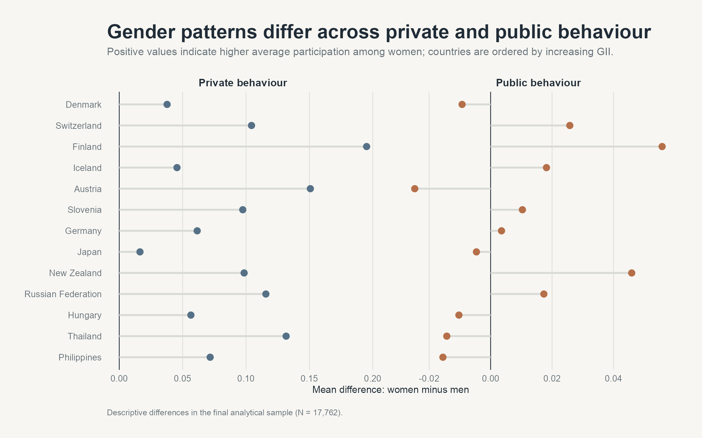
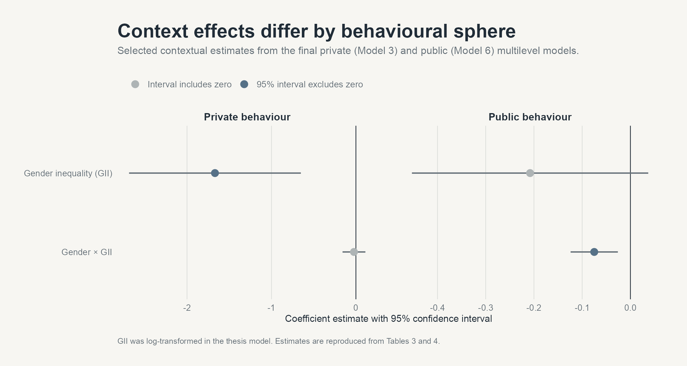

# Gender Differences in Pro-Environmental Behaviour

[← Portfolio overview](../../README.md) · [Personal website](https://1111jia.github.io/SLuo_Profile/)

### Evidence from a cross-national analysis

This study examines whether women and men participate differently in private and public pro-environmental behaviour, and whether national gender inequality changes those patterns. It combines individual survey responses from the ISSP Environment IV module with the UNDP Gender Inequality Index.


## Research question

Do gender differences in environmental behaviour remain consistent across countries, or do they depend on the surrounding level of gender inequality?

The analysis distinguishes:

- **Private behaviour:** recycling and avoiding products for environmental reasons.
- **Public behaviour:** signing petitions, donating, joining groups, and taking part in environmental protests.

## Study design

- **Data:** ISSP Environment IV (2020), ZA7650 Version 1.0.0
- **Coverage:** 13 countries
- **Analytical sample:** 17,762 respondents
- **Country context:** UNDP Gender Inequality Index (2021)
- **Methods:** index construction, principal component analysis, and multilevel linear regression

## What the analysis found

Women reported higher private PEB after individual characteristics were controlled for. In the final private-behaviour model, the estimated gender difference was **0.093 points** (SE = 0.012, p < .001). Higher national gender inequality was associated with lower private PEB, while the gender-by-GII interaction was not statistically significant.

For public PEB, the pattern depended more strongly on context. The final model estimated a positive gender coefficient (**0.016**, SE = 0.004) and a negative gender-by-GII interaction (**-0.075**, SE = 0.025). Within the model, this indicates that women's relative public participation became lower as country-level gender inequality increased.





## Interpretation

The results separate two forms of environmental action that can look similar in an aggregate score. The private-sphere gender difference was comparatively consistent, while the public-sphere difference varied with national context. This supports treating environmental behaviour as socially situated rather than as a single individual tendency.

These are observational associations. They do not establish that gender inequality causes individual behaviour.

## My contribution

I developed the research design, prepared and combined the individual- and country-level data, constructed the private and public PEB measures, ran the statistical analysis in R, interpreted the models, and wrote the thesis.

## Repository guide

- [Read the thesis](paper/Gender-differences-in-pro-environmental-behaviour.pdf)
- [Review the original analysis source](analysis/Gender_PEB.Rmd)
- [Rebuild the README figures](analysis/build_readme_figures.R)
- [Review data sources, measures, and access conditions](data/README.md)

<details>
<summary>Rebuild the visualisations</summary>

From the top-level `SLuo_Profile` folder, use R with these packages installed: `dplyr`, `ggplot2`, `ggrepel`, `patchwork`, `readr`, `scales`, and `tidyr`.

```sh
cd research/cross-national-environmental-behaviour
Rscript analysis/build_readme_figures.R
```

This recreates the three PNG figures from the included aggregate CSVs. It does not rerun the thesis models: the selected model estimates are transcribed from the thesis. Recreating the country aggregates also requires the ISSP microdata, the GII workbook, and the packages used in `analysis/prepare_public_data.R`. See the [data notes](data/README.md).

</details>

## Limitations

- The country sample has limited variation at the higher-equality end of the GII distribution.
- Complete-case analysis reduced the source sample and may introduce bias if missingness was systematic.
- The private and public PEB indices use a limited set of survey items.
- Estimates for country-level GII have wider uncertainty than most individual-level coefficients.

## Citation

Luo, Shengjia. *Gender Difference in Pro-Environmental Behaviors: Evidence from Cross-National Analysis*. Bachelor's thesis, Ludwig-Maximilians-Universität München, 2023.

The ISSP source should be cited separately as specified by GESIS: ISSP Research Group (2022), *International Social Survey Programme: Environment IV - ISSP 2020*, ZA7650 Version 1.0.0, GESIS, Cologne, [https://doi.org/10.4232/1.13921](https://doi.org/10.4232/1.13921).
