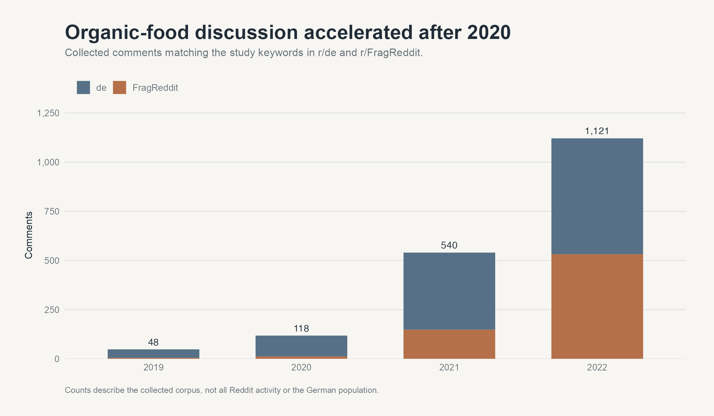
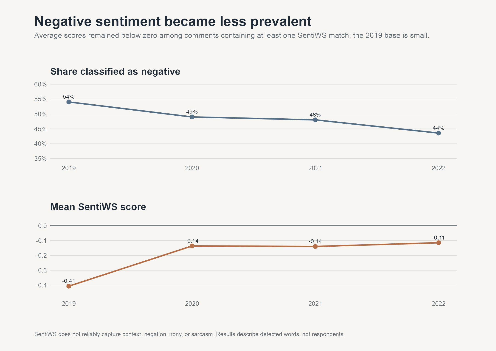

# Organic Food Attitudes in German Reddit Discussions

[← Portfolio overview](../../README.md) · [Personal website](https://1111jia.github.io/SLuo_Profile/)

### A social-listening study across 2019–2022

This project examines how organic food was discussed in two German-language Reddit communities before and during the COVID-19 period. It combines API-based data collection, German text preprocessing, keyword analysis, and lexicon-based sentiment scoring.



## Research questions

1. Can Reddit text analysis reveal patterns in attitudes toward organic food, including changes around the COVID-19 period?
2. How did discussions of health, taste, environmental impact, and price develop between 2019 and 2022?

## Study design

- **Corpus:** 1,827 comments
- **Period:** 2019–2022
- **Communities:** `r/de` and `r/FragReddit`
- **Collection:** organic-food keyword searches using PSAWR and Pushshift
- **Methods:** German-language tokenisation, stop-word filtering, stemming, keyword grouping, and SentiWS sentiment scoring

## What the analysis found

The collected discussion volume rose sharply after 2020, from **118 comments in 2020** to **540 in 2021** and **1,121 in 2022**. This increase describes the keyword-based corpus; it does not by itself establish a population-level change in organic-food interest.

Price was the most frequently matched of the four study themes. Across the full corpus, price-related terms appeared in 534 comments, compared with 295 health matches, 232 taste matches, and 140 environmental matches. Health-related discussion became more visible after 2020, while environmental terms remained the least frequently matched group.


Among comments containing at least one SentiWS match, the share classified as negative declined from **49% in 2020** to **44% in 2022**. Average annual sentiment nevertheless remained below zero. The 2019 result should be interpreted cautiously because the corpus for that year contains only 48 comments.



## Interpretation

The results point to a discussion shaped strongly by price and personal product experience. Health gained visibility during the pandemic period, while environmental language appeared less often. Because the design observes keyword-matched comments rather than the same users over time, the findings do not establish that the pandemic caused a change in public opinion.

## My contribution

I defined the collection keywords, gathered and prepared the Reddit data in R, developed the German-language text-processing workflow, applied the sentiment lexicon, compared discussion themes over time, and wrote the term paper.

## Repository guide

- [Read the portfolio research report](paper/Organic-food-attitudes-on-German-Reddit.pdf)
- [Review the original paper source](analysis/Term-paper.qmd)
- [Review the data-collection source](analysis/Data-Collection.qmd)
- [Rebuild the README figures](analysis/build_readme_figures.R)
- [Review the dataset and interpretation limits](data/README.md)

<details>
<summary>Rebuild the visualisations and portfolio report</summary>

From the top-level `SLuo_Profile` folder, use R with these packages installed: `dplyr`, `ggplot2`, `lsa`, `patchwork`, `readr`, `scales`, `SnowballC`, `stringr`, `tidyr`, and `tidytext`.

```sh
cd research/reddit-organic-food-research
Rscript analysis/build_readme_figures.R
```

The script reads the included corpus and downloads the SentiWS resource linked in the [data notes](data/README.md). Set `SENTIWS_PATH` to a local copy if needed. It rewrites the three figures and their aggregate CSVs. To rebuild the portfolio PDF from those outputs, use Python with `reportlab` installed:

```sh
python3 analysis/build_portfolio_report.py
```

The PDF is a portfolio summary. The original term paper remains in `analysis/Term-paper.qmd`; its referenced bibliography file and framework image were not supplied, so that source is not a self-contained full-paper export. The original collection script is retained as a historical record; the external API may require changes or renewed access before it can run today.

</details>

## Limitations

- The data come from two subreddits and do not represent the German population.
- User nationality and residence cannot be verified.
- The number of comments from 2019 is too small for a strong year-to-year comparison.
- Manual keyword groups may omit relevant language or include off-topic uses.
- Lexicon-based sentiment has limited sensitivity to German context, irony, sarcasm, and negation.

## Citation

Luo, Shengjia. *Is the COVID-19 Pandemic a Chance for Organic Food in Germany? Evidence from Reddit*. Term paper, Ludwig-Maximilians-Universität München, 2023.
